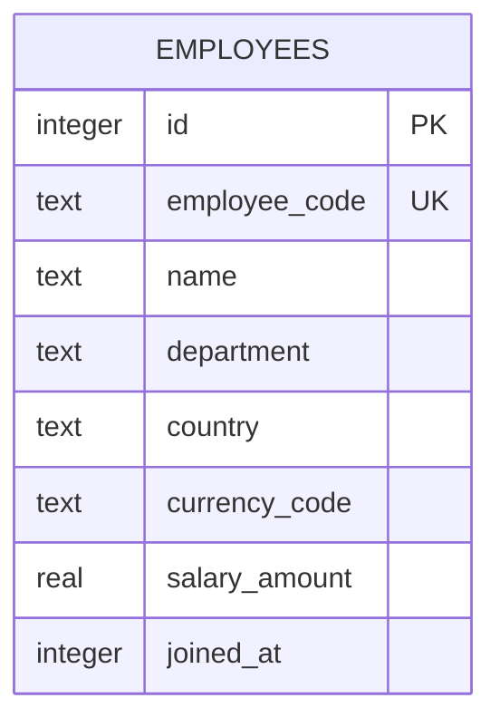

# Entity-Relationship Diagram

Current schema — a single `employees` table. This will expand as later features
(e.g. salary history) are deliberately deferred per `REQUIREMENTS.md`.

```mermaid
erDiagram
    EMPLOYEES {
        integer id PK
        text employee_code UK
        text name
        text department
        text country
        text currency_code
        real salary_amount
        integer joined_at
    }
```
